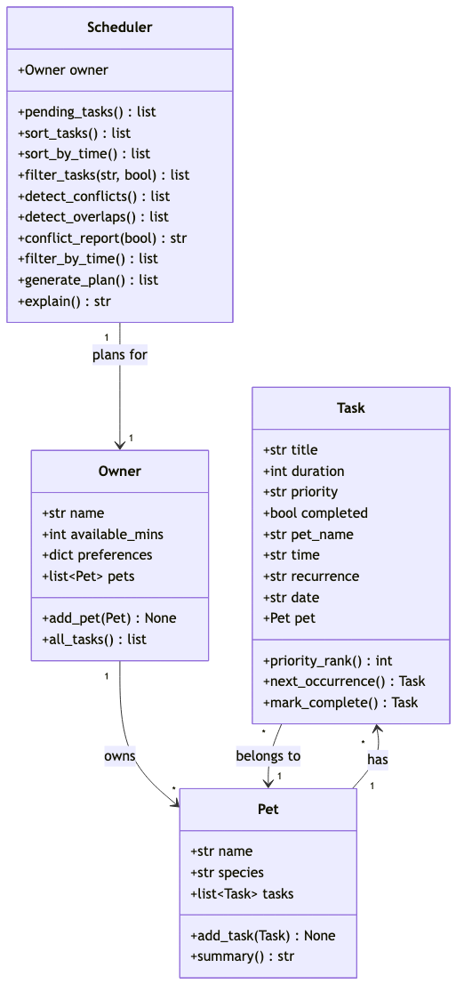

# PawPal+ (Module 2 Project)

You are building **PawPal+**, a Streamlit app that helps a pet owner plan care tasks for their pet.

## Scenario

A busy pet owner needs help staying consistent with pet care. They want an assistant that can:

- Track pet care tasks (walks, feeding, meds, enrichment, grooming, etc.)
- Consider constraints (time available, priority, owner preferences)
- Produce a daily plan and explain why it chose that plan

Your job is to design the system first (UML), then implement the logic in Python, then connect it to the Streamlit UI.

## What you will build

Your final app should:

- Let a user enter basic owner + pet info
- Let a user add/edit tasks (duration + priority at minimum)
- Generate a daily schedule/plan based on constraints and priorities
- Display the plan clearly (and ideally explain the reasoning)
- Include tests for the most important scheduling behaviors

## ✨ Features

PawPal+ turns a list of pet-care tasks into an explainable daily plan. The
scheduling algorithms (all in `pawpal_system.py`) are:

- **Priority sorting** — `Scheduler.sort_tasks()` orders pending tasks by
  priority rank (high → medium → low), breaking ties by shortest duration first.
- **Sorting by time** — `Scheduler.sort_by_time()` lists tasks chronologically by
  their `"HH:MM"` start time; untimed tasks sort to the end.
- **Filtering** — `Scheduler.filter_tasks()` returns tasks by pet name and/or
  completion status (each filter optional, pet matching is case-insensitive).
- **Time-budget planning** — `Scheduler.filter_by_time()` / `generate_plan()`
  greedily fit the highest-priority tasks into the owner's `available_mins`.
- **Conflict warnings (same start time)** — `Scheduler.detect_conflicts()` flags
  tasks that begin at the exact same `"HH:MM"`, across pets.
- **Conflict warnings (overlapping ranges)** — `Scheduler.detect_overlaps()` uses
  start + duration to catch partial overlaps a same-start check would miss
  (e.g. an 18:15 task inside an 18:00–18:30 window).
- **Daily / weekly recurrence** — `Task.mark_complete()` +
  `Task.next_occurrence()` auto-spawn the next instance of a recurring task,
  advanced by one day or one week and reset to not-completed.
- **Plan explanation** — `Scheduler.explain()` lists what was scheduled, what was
  skipped for lack of time, and the reasoning behind the order.

A more detailed method-by-method reference is in
[📐 Smarter Scheduling](#-smarter-scheduling) below.

## Getting started

### Setup

```bash
python -m venv .venv
source .venv/bin/activate  # Windows: .venv\Scripts\activate
pip install -r requirements.txt
```

### Suggested workflow

1. Read the scenario carefully and identify requirements and edge cases.
2. Draft a UML diagram (classes, attributes, methods, relationships).
3. Convert UML into Python class stubs (no logic yet).
4. Implement scheduling logic in small increments.
5. Add tests to verify key behaviors.
6. Connect your logic to the Streamlit UI in `app.py`.
7. Refine UML so it matches what you actually built.

## 🧩 Class Design (UML)

The class diagram below reflects the final implementation in `pawpal_system.py`
(`Task`, `Pet`, `Owner`, `Scheduler`) and their relationships. The Mermaid source
lives at [`diagrams/uml_final.mmd`](diagrams/uml_final.mmd).



## 🖥️ Sample Output

# Today's Schedule

Daily plan for Sam (55/60 min used):

- Feeding for Mittens (10 min) [priority: high]
- Morning walk for Biscuit (30 min) [priority: high]
- Litter cleanup for Mittens (15 min) [priority: medium]
  Skipped — not enough time left:
- Grooming for Biscuit (20 min) [priority: low]
  Reasoning: tasks are ordered by priority (high first), then by shortest duration, and added until the time budget runs out.

## 🧪 Testing PawPal+

Run the full test suite from the project root:

```bash
python -m pytest
```

`pytest.ini` sets `pythonpath = .`, so the command works without any extra
environment setup.

### What the tests cover

The suite in `tests/test_pawpal.py` verifies the core scheduling behaviors:

- **Task completion** — `mark_complete()` flips a task's status to completed.
- **Task assignment** — adding a task to a `Pet` increases that pet's task count.
- **Sorting correctness** — `sort_by_time()` returns tasks in chronological
  order, with untimed tasks sorting last.
- **Recurrence logic** — completing a `"daily"` task auto-spawns a new instance
  dated one day later, reset to not-completed.
- **Conflict detection** — `detect_conflicts()` flags tasks that share the exact
  same start time (and leaves non-clashing tasks alone).

### Sample test output

```
============================= test session starts ==============================
platform darwin -- Python 3.13.2, pytest-9.1.1, pluggy-1.6.0
rootdir: /Users/alexistorosina/Desktop/codepath/ai110-module2show-pawpal-starter
configfile: pytest.ini
testpaths: tests
plugins: anyio-4.14.0
collected 5 items

tests/test_pawpal.py .....                                               [100%]

============================== 5 passed in 0.04s ===============================
```

### Confidence Level

**★★★★☆ (4/5)** — The most important scheduling behaviors (sorting, recurrence,
and conflict detection) are verified and passing. Confidence is held at 4 rather
than 5 because some edge cases are not yet covered: the time-budget greedy
selector (`filter_by_time`), interval-overlap detection (`detect_overlaps`),
month/year date rollovers for recurring tasks, and the `date.today()` fallback
when a recurring task has no explicit date.

## 📐 Smarter Scheduling

All scheduling logic lives in `pawpal_system.py` (classes `Task`, `Pet`, `Owner`,
`Scheduler`). Each feature below names the method that implements it.

| Feature                     | Method(s)                                          | Notes                                                                   |
| --------------------------- | -------------------------------------------------- | ----------------------------------------------------------------------- |
| Sort by priority            | `Scheduler.sort_tasks()`                           | Orders pending tasks by priority rank, then shortest duration.          |
| Sort by time                | `Scheduler.sort_by_time()`                         | Chronological by `"HH:MM"` start; untimed tasks sort last.              |
| Filter by pet / status      | `Scheduler.filter_tasks()`                         | Optional `pet_name` and/or `completed` filters; both optional.          |
| Filter by time budget       | `Scheduler.filter_by_time()`                       | Greedily keeps tasks that fit within the owner's `available_mins`.      |
| Recurring tasks             | `Task.mark_complete()`, `Task.next_occurrence()`   | Completing a `"daily"`/`"weekly"` task auto-spawns the next instance.   |
| Conflict handling (basic)   | `Scheduler.detect_conflicts()`                     | Lightweight: flags tasks sharing the exact same start time.             |
| Conflict handling (overlap) | `Scheduler.detect_overlaps()`                      | Stronger: flags overlapping time _ranges_ using start + duration.       |
| Conflict report             | `Scheduler.conflict_report()`                      | Returns a warning string (never raises); `check_overlaps` toggles mode. |
| Build & explain the plan    | `Scheduler.generate_plan()`, `Scheduler.explain()` | Produces the final ordered plan and a human-readable rationale.         |

### Feature details

- **Sorting.** `sort_tasks()` ranks by priority (`PRIORITY_RANK`) then duration;
  `sort_by_time()` uses a lambda key on the `"HH:MM"` string, which sorts
  chronologically because the values are zero-padded 24-hour times.
- **Filtering.** `filter_tasks(pet_name=..., completed=...)` skips any filter
  left as `None`, so it handles "all of Mochi's tasks", "all open tasks", or
  both at once. `filter_by_time()` is the time-budget greedy selector.
- **Recurring tasks.** `Task.recurrence` is `"none"`, `"daily"`, or `"weekly"`.
  When `mark_complete()` is called, `next_occurrence()` clones the task (via
  `dataclasses.replace`) with its `date` advanced by `RECURRENCE_DELTAS` and
  appends it to the same pet using the `Task.pet` back-reference.
- **Conflict detection.** `detect_conflicts()` is the lightweight same-start-time
  check; `detect_overlaps()` is the stronger interval check that also catches
  partial overlaps (e.g. an 18:15 task inside an 18:00–18:30 task). Both return
  warning strings and skip untimed/malformed entries rather than crashing.

## 🎬 Demo Walkthrough

### The Streamlit app

Launch the interactive UI with:

```bash
streamlit run app.py
```

The app has three areas:

1. **Quick Demo Inputs** — set the owner's name, the daily time budget (in
   minutes), and the pet's name and species.
2. **Tasks** — add care tasks (title, duration, priority, start time) with the
   **Add task** button. The task table can be re-ordered with the **Sort tasks
   by** toggle (Priority or Start time), shows an at-a-glance metrics row
   (pending tasks, time needed, daily budget), and surfaces any scheduling
   conflicts as a warning beneath it.
3. **Build Schedule** — the **Generate schedule** button runs the Scheduler over
   the available time budget, shows the chosen tasks, and prints the plain-text
   explanation of what was scheduled and why.

### Example workflow

1. Enter the owner (`Sam`, `60` minutes) and a pet (`Biscuit`, `dog`).
2. Add a few tasks — e.g. an 18:00 high-priority "Evening walk" (30 min) and a
   09:30 low-priority "Grooming" (20 min).
3. Add a second pet's task that starts at 18:00 too (e.g. "Vet call") to trigger
   a conflict.
4. Watch the **conflict warning** appear under the task table, flagging the
   18:00 clash in plain language.
5. Click **Generate schedule** to see the prioritized, time-budgeted plan plus
   the reasoning, and the metrics row showing minutes used vs. your budget.

### Key Scheduler behaviors on display

- **Sorting** — toggle between priority order and chronological order.
- **Filtering / time budget** — only the tasks that fit in `available_mins` are
  scheduled; lower-priority tasks that don't fit are reported as skipped.
- **Conflict warnings** — same-start-time and overlapping-range clashes are shown
  as amber advisories (never errors), with a suggested fix.
- **Recurrence** — completing a daily/weekly task spawns its next occurrence.

### Sample CLI output (`python main.py`)

`main.py` is a non-interactive demo that exercises the same Scheduler methods and
prints to the terminal:

```text
Completing Feeding (daily) and Grooming (weekly)...
  Feeding spawned next: Feeding on 2026-07-01
  Grooming spawned next: Grooming on 2026-07-07
PawPal+ Demo
========================================

All tasks (insertion order)
----------------------------------------
  ---------- 18:00  Evening walk     Biscuit  [high] (open)
  2026-06-30 09:30  Grooming         Biscuit  [low] (done) {weekly}
  2026-07-07 09:30  Grooming         Biscuit  [low] (open) {weekly}
  2026-06-30 07:15  Feeding          Mittens  [high] (done) {daily}
  ---------- 12:45  Litter cleanup   Mittens  [medium] (open)
  ---------- 18:00  Vet call         Mittens  [high] (open)
  ---------- 18:15  Pill time        Mittens  [medium] (open)
  2026-07-01 07:15  Feeding          Mittens  [high] (open) {daily}

Pending tasks sorted by time
----------------------------------------
  2026-07-01 07:15  Feeding          Mittens  [high] (open) {daily}
  2026-07-07 09:30  Grooming         Biscuit  [low] (open) {weekly}
  ---------- 12:45  Litter cleanup   Mittens  [medium] (open)
  ---------- 18:00  Evening walk     Biscuit  [high] (open)
  ---------- 18:00  Vet call         Mittens  [high] (open)
  ---------- 18:15  Pill time        Mittens  [medium] (open)

Filter: Biscuit's tasks
----------------------------------------
  ---------- 18:00  Evening walk     Biscuit  [high] (open)
  2026-06-30 09:30  Grooming         Biscuit  [low] (done) {weekly}
  2026-07-07 09:30  Grooming         Biscuit  [low] (open) {weekly}

Filter: completed tasks
----------------------------------------
  2026-06-30 09:30  Grooming         Biscuit  [low] (done) {weekly}
  2026-06-30 07:15  Feeding          Mittens  [high] (done) {daily}

Filter: open tasks
----------------------------------------
  ---------- 18:00  Evening walk     Biscuit  [high] (open)
  2026-07-07 09:30  Grooming         Biscuit  [low] (open) {weekly}
  ---------- 12:45  Litter cleanup   Mittens  [medium] (open)
  ---------- 18:00  Vet call         Mittens  [high] (open)
  ---------- 18:15  Pill time        Mittens  [medium] (open)
  2026-07-01 07:15  Feeding          Mittens  [high] (open) {daily}

Conflict check (lightweight: same start time)
----------------------------------------
Found 1 conflict(s):
⚠️ Conflict at 18:00: Evening walk (Biscuit), Vet call (Mittens)

Conflict check (stronger: overlapping time ranges)
----------------------------------------
Found 2 conflict(s):
⚠️ Overlap: Evening walk (Biscuit) 18:00–18:30 vs Vet call (Mittens) 18:00–18:10
⚠️ Overlap: Evening walk (Biscuit) 18:00–18:30 vs Pill time (Mittens) 18:15–18:20

========================================
Daily plan for Sam (55/60 min used):
  - Vet call for Mittens (10 min) [priority: high]
  - Feeding for Mittens (10 min) [priority: high]
  - Evening walk for Biscuit (30 min) [priority: high]
  - Pill time for Mittens (5 min) [priority: medium]
Skipped — not enough time left:
  - Litter cleanup for Mittens (15 min) [priority: medium]
  - Grooming for Biscuit (20 min) [priority: low]
Reasoning: tasks are ordered by priority (high first), then by shortest duration, and added until the time budget runs out.
```
